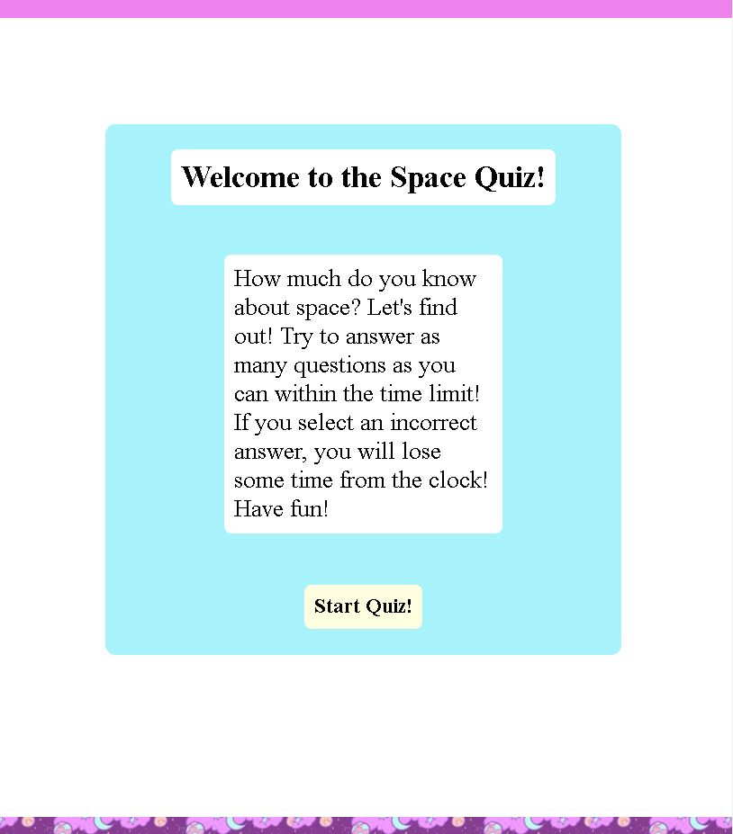
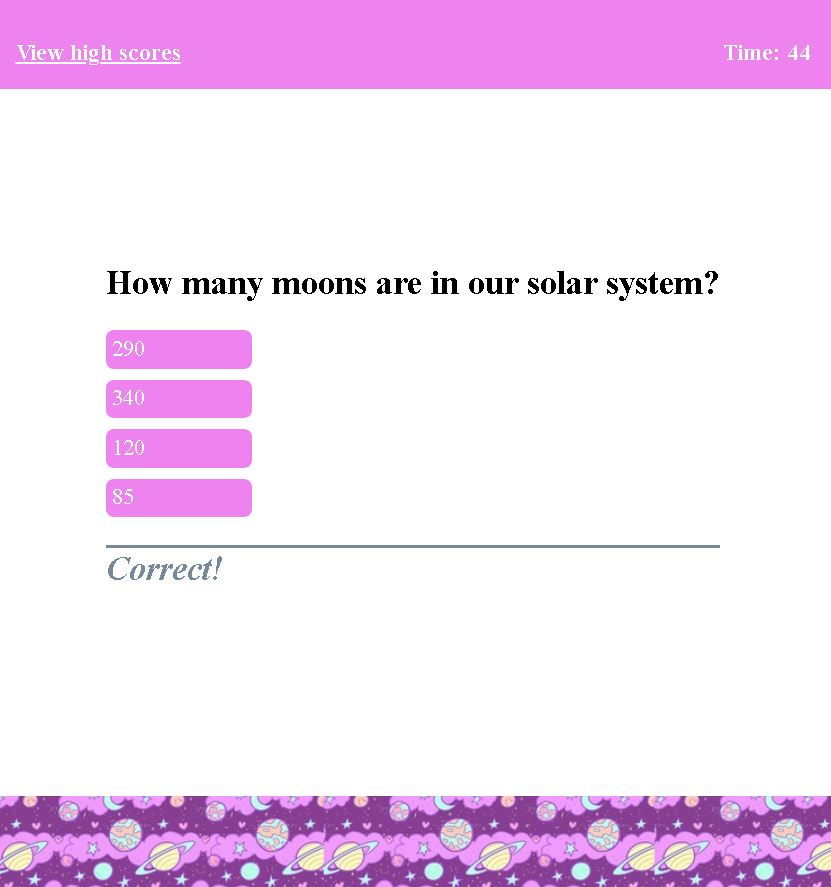
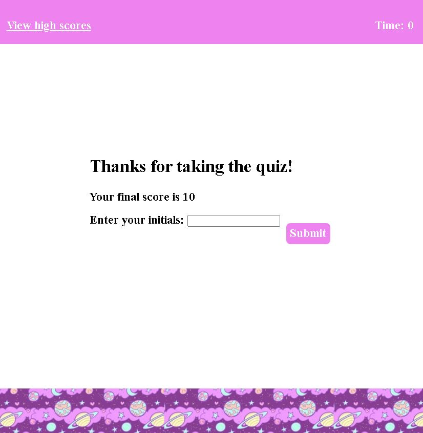

# Space-Quiz

## Description

This project is a timed quiz that asks you questions about space! I wanted to build this project so I could make a website functional. So far I've made websites with HTML and CSS but those sites had no functionality. Now, with this project I know how to use JavaScript to make a website functional. When the user clicks on buttons, it causes the page to change or do something. While making this project, I found the HTML and CSS to be fun and relatively easy, but the JavaScript was more challenging. I learned a lot of things, the main thing I learned was how to add styles and classes to HTML elements using JavaScript, which is how the quiz works. When the user clicks the start button, or the answer buttons, the page will change by either moving on to the next page, or telling the user they selected the wrong answer and subtracting time from the clock. Speaking of the clock, making the clock tick down and reducing time from it was another challenge I faced while making this project. The last roadblock I faced was the high score page. You will see that the initials and score are saved, and if you replay the quiz without refreshing the page the previous scores will still be there. However, if the page is refreshed the scores are not saved. I had tried to use local storage to get the scores to save, but unfortunately I couldn't figure that part out. I hope that by making my next couple of projects I will learn how to use local storage more effectively.

## Usage

Here is the link to the website:
<a href="https://breeprimmer.github.io/Space-Quiz/">

To play the quiz, press the "Start Quiz!" button on the starting page.

 Keep in mind that you have a time limit, and if you chose the wrong answer, time will be subtracted from the clock! When the quiz starts, you will be presented with different questions about space. You can click on the multiple choice answers. When you click the wrong answer, you will stay on the same question and the screen will tell you that you chose the wrong answer. If you chose the right answer, you will move on to the next question and the screen will tell you that you chose the right answer.
 
 
 
  If the timer runs out, or you answered all the questions correctly, you will be done with the quiz and brought to the "enter your initials" page. Please enter in your name or initials and then click submit or hit enter. 
  
 
  
  This will bring you to the high scores page, where it will list your previous scores and initials. You can click the play again button to restart the quiz and play again, or you can hit clear scores to clear your previous scores. 
  
  
  
  At any point in time if you wish to view your scores while taking the quiz, you can click the view high scores button on the top left of the screen.

## Credits

This youtube video was a huge help, it helped me get started on my code. I deviated quite a bit from the video in terms of how I wrote my code, as I just watched the first part of it mostly. It is from Web Dev Simplified on youtube.
https://www.youtube.com/watch?v=riDzcEQbX6k

removeProperty from MDN 
https://developer.mozilla.org/en-US/docs/Web/API/CSSStyleDeclaration/removeProperty

visibility from MDN
https://developer.mozilla.org/en-US/docs/Web/CSS/visibility

display properties from W3 Schools
https://www.w3schools.com/cssref/pr_class_display.php

how to subtract time from a timer
https://stackoverflow.com/questions/58964755/subtract-time-from-timer-if-answer-is-wrong-creating-a-quiz-javascript

how to prevent default on enter 
https://www.w3schools.com/howto/howto_js_trigger_button_enter.asp

how to do addition in javascript
https://smallbusiness.chron.com/addition-javascript-37069.html

how to console log input value
https://forum.freecodecamp.org/t/why-my-input-value-is-not-showing-in-the-console/256453

createElment() method from MDN
https://developer.mozilla.org/en-US/docs/Web/API/Document/createElement

createTextNode() method from W3 Schools
https://www.w3schools.com/jsref/met_document_createtextnode.asp